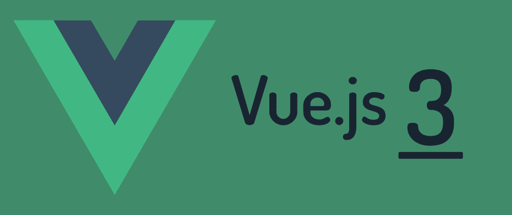

<div align="center" id="top"> 
  
  &#xa0;
</div>

<h1 align="center">Front Chat</h1>

<p align="center">
  

  

  

  

</p>

Status

<h4 align="center"> 
	🚧  Front Chat 🚀 Em construção...  🚧
</h4> 

<hr>

<p align="center">
  <a href="#dart-sobre">Sobre</a> &#xa0; | &#xa0; 
  <a href="#sparkles-funcionalidades">Funcionalidades</a> &#xa0; | &#xa0;
  <a href="#rocket-tecnologias">Tecnologias</a> &#xa0; | &#xa0;
  <a href="#white_check_mark-pré-requisitos">Pré requisitos</a> &#xa0; | &#xa0;
  <a href="#checkered_flag-começando">Começando</a> &#xa0; | &#xa0;
  <a href="#memo-licença">Licença</a> &#xa0; | &#xa0;
  <a href="https://github.com/RafaelCava" target="_blank">Autor</a>
</p>

<br>

## :dart: Sobre ##

Projeto para estudo de [Websockets](https://pt.wikipedia.org/wiki/WebSocket), [Vue](https://vuejs.org/) e [TypeScript](https://www.typescriptlang.org/)

## :sparkles: Funcionalidades ##

:heavy_check_mark: Possui um front bem estruturado\
:heavy_check_mark: Realiza autenticações com o back-end\
:heavy_check_mark: Realiza o envio de mensagens em tempo real para outras pessoas que estiverem nas salas\
:heavy_check_mark: Realiza a criação de salas\
:heavy_check_mark: Realiza a criação de usuários

## :rocket: Tecnologias ##

As seguintes ferramentas foram usadas na construção do projeto:

- [Node.js](https://nodejs.org/en/)
- [TypeScript](https://www.typescriptlang.org/)
- [Axios](https://axios-http.com/ptbr/docs/intro)
- [Vue3](https://vuejs.org/)
- [Vuex](https://vuex.vuejs.org/)
- [Vue Router](https://router.vuejs.org/)
- [PrimeVUE](https://www.primefaces.org/primevue/)
- [Docker](https://www.docker.com/)
- [Socket.io](https://socket.io/)
- [Nginx](https://www.nginx.com/)
- [Jest](https://jestjs.io/pt-BR/)
- [Eslint](https://eslint.org/)
- [Husky](https://typicode.github.io/husky/)
- [Commitlint](https://github.com/conventional-changelog/commitlint)
- [Commitizen](https://github.com/commitizen/cz-cli)

## :white_check_mark: Pré requisitos ##

Antes de começar :checkered_flag:, você precisa ter o [Git](https://git-scm.com) e o [Node](https://nodejs.org/en/) ou [docker](https://www.docker.com/) instalados em sua maquina.

## :checkered_flag: Começando ##

```bash
# Clone este repositório
$ git clone https://github.com/RafaelCava/front-chat

# Entre na pasta
$ cd front-chat

# Instale as dependências
$ yarn

# Para iniciar o projeto
$ yarn start

# O app vai inicializar em <http://localhost:8080>

## Caso prefira usar docker

$ docker-compose up -d
# O app vai inicializar em <http://localhost:8080>

```

## :memo: Licença ##

Este projeto está sob licença MIT. Veja o arquivo [LICENSE](LICENSE) para mais detalhes.


Feito com :heart: por <a href="https://github.com/RafaelCava" target="_blank">Rafael Cavalcante</a>

&#xa0;

<a href="#top">Voltar para o topo</a>
